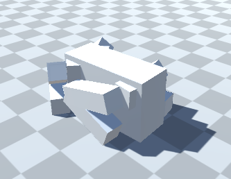
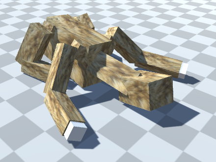

# DogML

Unity + machine learning + quadruped

I've made walking robots before that used predefined patterns for leg movements.
I've always simulated my robots before building them to test my ideas without spending cash.

I'm using Unity 2021.3f.  I followed the Youtube guide at https://www.youtube.com/watch?v=zPFU30tbyKs
Please familiarize yourself with it before proceeding.
to setup https://github.com/Unity-Technologies/ml-agents.  Once you have the python setup installed
you can open the sample scene in Unity.

I used a thin/tall body instead of a wide/flat body because I believe it will be better at self-righting when it has a lower center of gravity.

## The environment

The environment is a "prefab" Dog and a DogController.

Dog is made of ArticulatedBody in a heirarchy.  Dog has Torso has hips has thighs has calves has feet.
Each part of Dog also contains a box to represent the mesh and a collision boundary.  ArticulatedBody joints have been limited to one axis each and given a reasonable range of motion.

### DogController
DogController is a stub that controls the Machine Learning.

#### OnEpisodeBegin
in *OnEpisodeBegin* it instantiates (clones) the original dog and rotates it a bit so the system doesn't over-specialize.  Cloning was much easier than resetting values.

#### CollectObservations
in *CollectObservations* it measures 

- every joint position (the one angle that can change in each joint), 
- is the foot in touch with the floor,
- how much is the torso facing upward
- how high is the torso off the ground

#### OnActionReceived
in *OnActionReceived* it applies the ContinuousActions received from the network to the joints.
Because they are ArticulatedBody type I can use `SetDriveTargets` to set a target angle for each joint.

## Challenges

#### OnActionReceived driving joints
I have tried a few strategies in `OnActionReceived`:

1. newTarget = action * (upperAngle - lowerAngle) + lowerAngle;
2. newTarget = oldTarget+(action\*10)-5;
3. newTarget = action;

all of which are then bounded by `newTarget = max(min( newTarget, upperAngle ), lowerAngle);`

#### SetDriveTargets API is not well described.

> The exact location of the data in resulting list for the specific articulation body can be found by calling `ArticulationBody.GetDofStartIndices` and indexing returned `dofStartIndices` list by the particular body index via `ArticulationBody.index`.

-- https://docs.unity3d.com/ScriptReference/ArticulationBody.SetDriveTargets.html